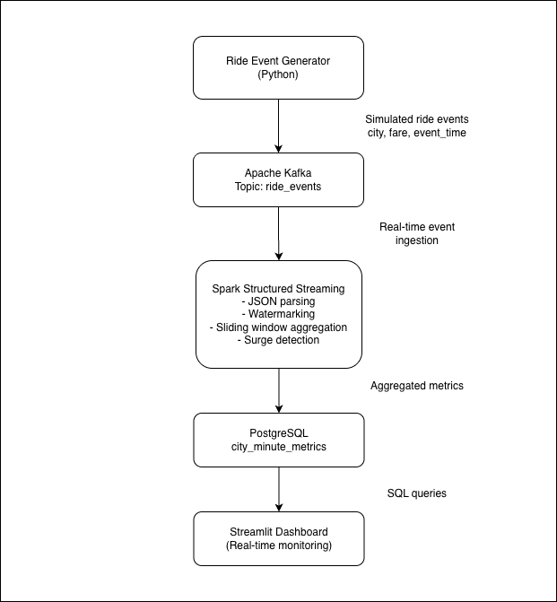
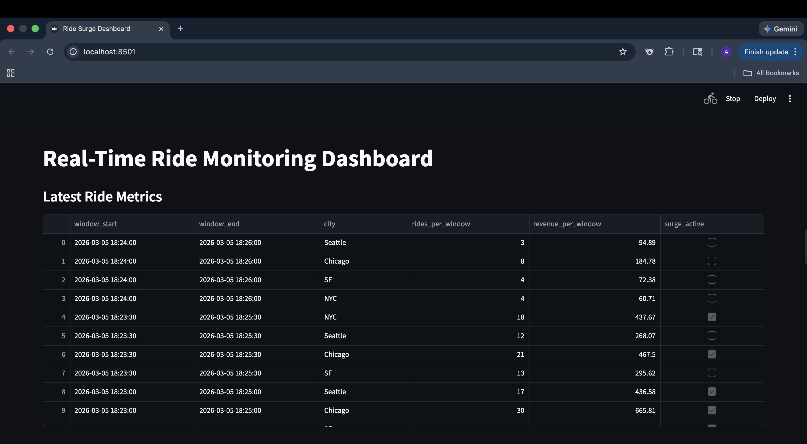

# RideStream – Real-Time Ride Monitoring

RideStream is a real-time ride analytics pipeline built with Kafka, Spark Structured Streaming, PostgreSQL, and Streamlit.

The system ingests ride events, processes them in real-time, detects surge conditions, and visualizes ride metrics in a live dashboard.

---

# Architecture



---
# System Flow
```
Ride Event Generator (Python)
Simulates ride events containing:
- ride_id
- city
- fare
- event_time
        ↓
Apache Kafka
Topic: ride_events
Handles real-time ingestion of ride event streams.
        ↓
Spark Structured Streaming
Processes events by:
- Parsing JSON messages
- Applying watermarking
- Performing sliding window aggregations
- Detecting surge conditions
        ↓
PostgreSQL
Table: city_minute_metrics

Stores aggregated metrics:
- window_start
- window_end
- city
- rides_per_window
- revenue_per_window
- surge_active
        ↓
Streamlit Dashboard
Real-time monitoring interface displaying:
- Latest ride metrics
- Rides per city
- Revenue per city
- Surge alerts
```

### Data Pipeline

```
Ride Event Generator → Kafka → Spark Streaming → PostgreSQL → Streamlit Dashboard
```
---

# Tech Stack

- Apache Kafka
- Apache Spark Structured Streaming
- PostgreSQL
- Streamlit
- Python
- Docker

---
# Dashboard

### Real-Time Ride Monitoring Dashboard



---

### Rides Per City


---

### Revenue Per City


---

### Surge Alerts


---

# Features

- Real-time ride event streaming
- Sliding window aggregation
- Surge detection logic
- City-level ride metrics
- Live monitoring dashboard

---

# Example Metrics

- rides_per_window
- revenue_per_window
- surge_active
- city-level aggregation

---

# Future Improvements

- JDBC batch write optimization
- Kafka partition scaling
- Docker Compose deployment
- Cloud deployment (AWS / GCP)
