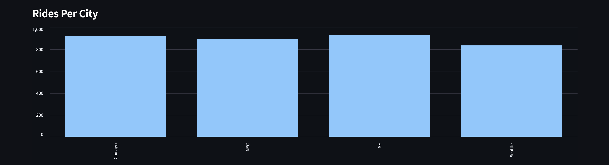
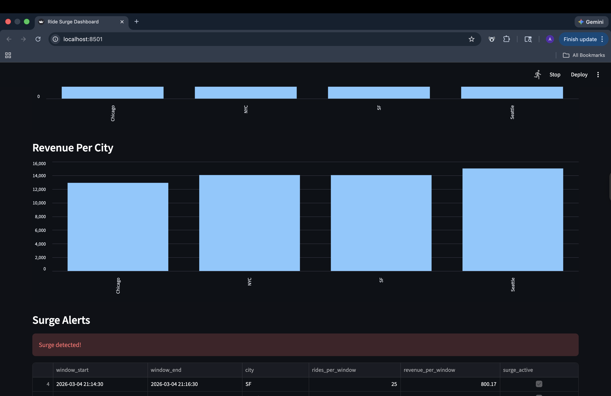
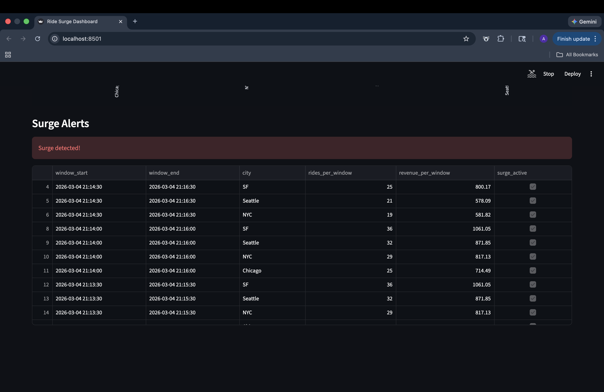

# RideStream – Real-Time Ride Monitoring

RideStream is a real-time data engineering pipeline that simulates ride-sharing events, processes them with Spark Structured Streaming, stores aggregated metrics in PostgreSQL, and visualizes results in a Streamlit dashboard.

The system demonstrates key streaming concepts such as event-time processing, watermarking, windowed aggregation, and surge detection.

---
# System Architecture
```
Ride Event Generator → Kafka → Spark Streaming → PostgreSQL → Streamlit Dashboard
```
---

# Features

- Real-time ride event simulation
- Kafka-based streaming ingestion
- Spark Structured Streaming processing
- Event-time window aggregations
- Watermarking to handle late data
- Surge detection logic
- PostgreSQL storage layer
- Live Streamlit dashboard
- Environment configuration using .env
- Unit testing for surge detection

---

# Tech Stack

| Component         | Technology                        |
| ----------------- | --------------------------------- |
| Event Streaming   | Apache Kafka                      |
| Stream Processing | Apache Spark Structured Streaming |
| Database          | PostgreSQL                        |
| Dashboard         | Streamlit                         |
| Infrastructure    | Docker                            |
| Language          | Python                            |

---
# Project Structure
```
ride-stream
│
├── docker-compose.yml
├── requirements.txt
├── config.py
├── surge_logic.py
│
├── ride_event_generator.py
├── spark_job.py
├── streamlit_dashboard.py
│
├── tests
│   └── test_surge_detection.py
│
├── assets
│   ├── architecture.png
│   ├── dashboard_metrics.png
│   ├── rides_per_city_chart.png
│   ├── revenue_per_city_chart.png
│   └── surge_alerts_table.png
│
└── README.md
```
---
# Architecture


---
# System Flow
```
Ride Event Generator
↓
Kafka (ride_events topic)
↓
Spark Structured Streaming
↓
PostgreSQL (city_minute_metrics)
↓
Streamlit Dashboard
```
---
# Dashboard

### Real-Time Ride Monitoring Dashboard


---

### Rides Per City



---

### Revenue Per City



---

### Surge Alerts



---
# Quick Start 
### 1. Start Infrastructure
Start Kafka, Zookeeper, and PostgreSQL:
```
docker compose up -d
```
Verify containers:
```
docker ps
```

### 2. Install Dependencies 
```
pip install -r requirements.txt
```

### 3. Create Database Table
```
Connect to PostgreSQL:
docker exec -it postgres psql -U admin -d rides
Create the metrics table:
CREATE TABLE city_minute_metrics (
    window_start TIMESTAMP,
    window_end TIMESTAMP,
    city TEXT,
    rides_per_window INTEGER,
    revenue_per_window DOUBLE PRECISION,
    surge_active BOOLEAN,
    PRIMARY KEY (window_start, city)
);
```

### 4. Run the Event Generator
```
python ride_event_generator.py
```

### 5. Start the Spark Streaming job
```
spark-submit \
--packages org.apache.spark:spark-sql-kafka-0-10_2.12:3.5.0 \
spark_job.py
```

### 6. Launch the dashboard
```
streamlit run streamlit_dashboard.py
```
---
# Streaming Logic
The Spark job performs the following steps:
1. Reads ride events from Kafka
2. Parses JSON messages
3. Converts event timestamps
4. Applies watermarking to handle late data
5. Performs sliding window aggregations
6. Calculates:
- rides per window
- revenue per window
- surge activation flag
7. Writes aggregated results to PostgreSQL.
---
# Testing
Unit tests validate the surge detection logic.
```
pytest 
```
Example Test:
```
assert detect_surge(20) == True
assert detect_surge(5) == False
```
---
# Future Improvements
- Kafka partition scaling
- Spark checkpoint durability
- Dockerized Spark cluster
- CI/CD pipeline
- Data quality monitoring
- Advanced surge pricing models
