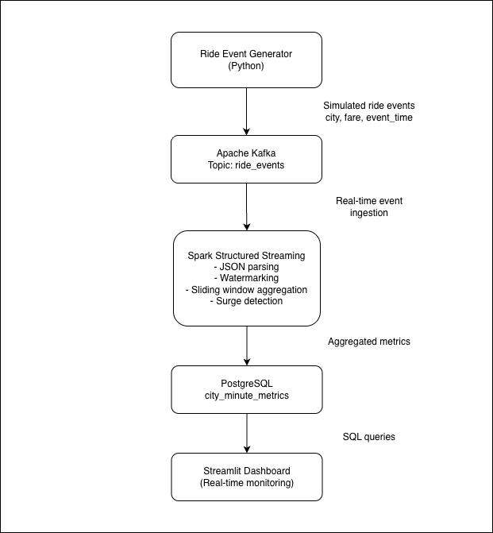
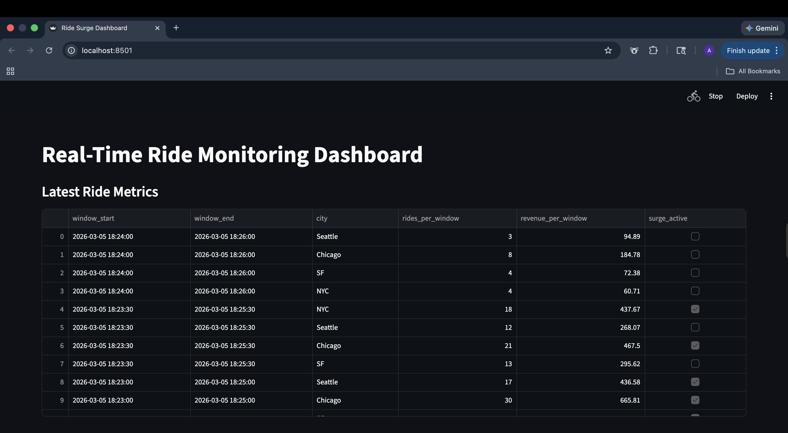
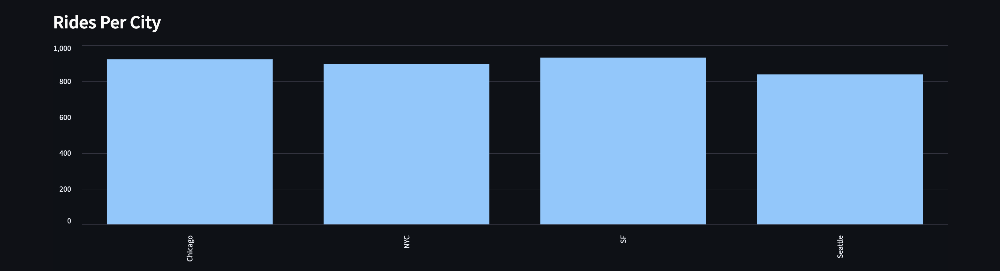
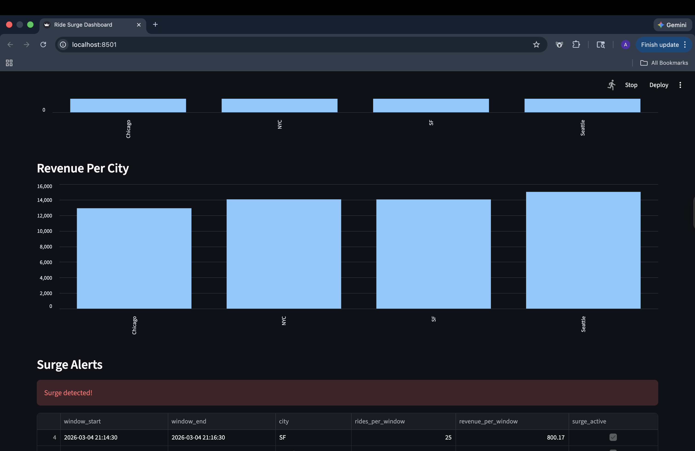
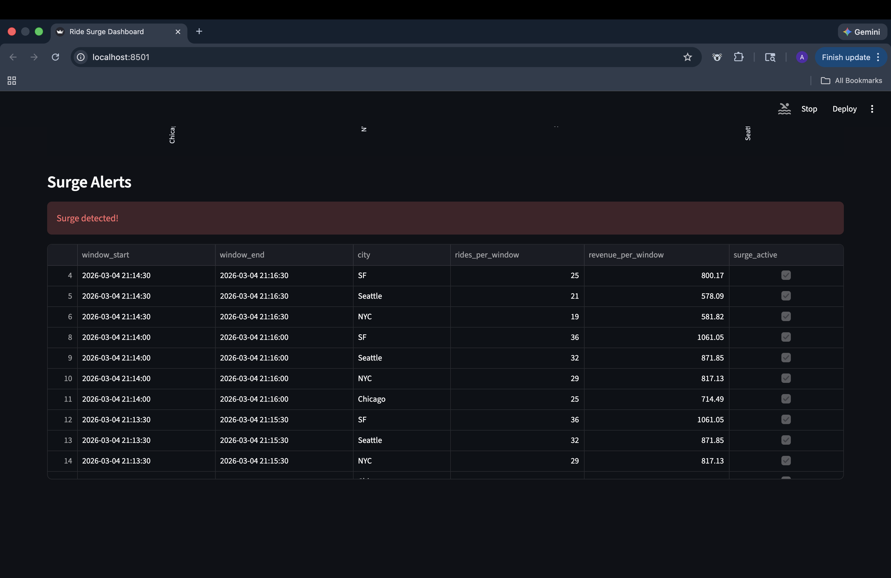

# RideStream – Real-Time Ride Monitoring Pipeline 

RideStream is a real-time data engineering pipeline that simulates ride-sharing events and processes them using Kafka and Spark Structured Streaming.

The system demonstrates production-oriented concepts such as event-time processing, watermarking, windowed aggregations, surge detection, and testable pipeline design with isolated components and mocked dependencies.

---
## System Architecture
```
Ride Event Generator → Kafka → Spark Streaming → PostgreSQL → Streamlit Dashboard
```
---

## Features

- Real-time ride event simulation
- Kafka-based streaming ingestion
- Spark Structured Streaming with event-time processing
- Windowed aggregations with watermarking for late data handling
- Surge detection based on ride demand thresholds
- PostgreSQL sink for aggregated metrics
- Interactive Streamlit dashboard for visualization
- Modular and testable pipeline components

---

## Tech Stack

| Component         | Technology                        |
| ----------------- | --------------------------------- |
| Event Streaming   | Apache Kafka                      |
| Stream Processing | Apache Spark Structured Streaming |
| Database          | PostgreSQL                        |
| Dashboard         | Streamlit                         |
| Infrastructure    | Docker                            |
| Language          | Python                            |

---
## Project Structure
```
ride-stream
│
├── docker-compose.yml
├── requirements.txt
├── config.py
├── surge_logic.py
│
├── ride_event_generator.py
├── spark_job.py
├── streamlit_dashboard.py
│
├── tests/
│   ├── test_schema.py
│   └── test_surge_detection.py
│
├── .github/
│   └── workflows/
│       └── ci.yml
│
├── assets/
│   ├── architecture.png
│   ├── dashboard_metrics.png
│   ├── rides_per_city_chart.png
│   ├── revenue_per_city_chart.png
│   └── surge_alerts_table.png
│
└── README.md
```
---
## Architecture



---
## System Flow
```
Ride Event Generator
↓
Kafka (ride_events topic)
↓
Spark Structured Streaming
↓
PostgreSQL (city_minute_metrics)
↓
Streamlit Dashboard
```
---
## Dashboard

### Real-Time Ride Monitoring Dashboard



---

### Rides Per City



---

### Revenue Per City



---

### Surge Alerts



---
## Quick Start 
### 1. Start Infrastructure
Start Kafka, Zookeeper, and PostgreSQL:
```
docker compose up -d
```
Verify containers:
```
docker ps
```

### 2. Install Dependencies 
```
pip install -r requirements.txt
```

### 3. Create Database Table
```
Connect to PostgreSQL:
docker exec -it postgres psql -U admin -d rides
Create the metrics table:
CREATE TABLE city_minute_metrics (
    window_start TIMESTAMP,
    window_end TIMESTAMP,
    city TEXT,
    rides_per_window INTEGER,
    revenue_per_window DOUBLE PRECISION,
    surge_active BOOLEAN,
    PRIMARY KEY (window_start, city)
);
```

### 4. Run the Event Generator
```
python ride_event_generator.py
```

### 5. Start the Spark Streaming job
```
spark-submit \
--packages org.apache.spark:spark-sql-kafka-0-10_2.12:3.5.0 \
spark_job.py
```

### 6. Launch the dashboard
```
streamlit run streamlit_dashboard.py
```
---
## Streaming Logic

The Spark job performs:

- Ingests ride events from Kafka
- Parses and structures JSON messages
- Applies event-time processing with watermarking
- Performs windowed aggregations
- Computes:
  - rides per window
  - revenue per window
  - surge activation flag
- Writes results to PostgreSQL
---
## Testing

The project includes unit tests covering:

- Surge detection logic with boundary and edge case validation
- Event schema validation to ensure consistent data structure
- Handling of invalid inputs and malformed data

External dependencies such as Kafka are mocked to ensure tests run reliably without requiring a running cluster.

Run tests:

```bash
pytest
```
---
## Production Considerations

This project is designed for local execution as a portfolio demonstration.  
In a production environment, the following enhancements would be required:

- **Kafka:** Multi-broker cluster with replication factor ≥ 3 and partitioning for scalability
- **Spark Deployment:** Running on Kubernetes or managed platforms (Databricks / EMR)
- **Storage Layer:** Use columnar OLAP systems (ClickHouse / BigQuery) instead of PostgreSQL
- **Schema Management:** Avro + Schema Registry for enforcing data contracts
- **Fault Tolerance:** Persistent checkpointing (S3/GCS) for recovery and exactly-once semantics
- **Monitoring:** Observability via Prometheus + Grafana (consumer lag, throughput, errors)
